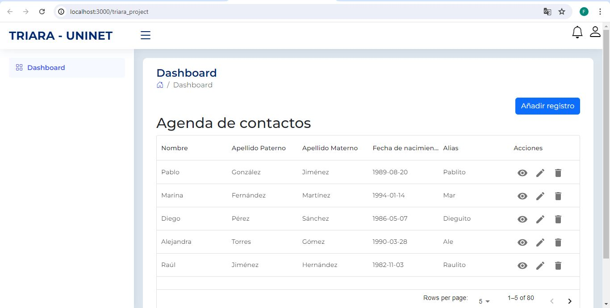
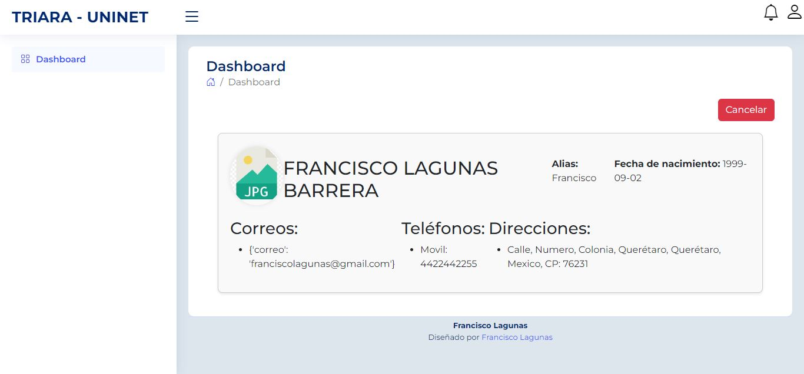
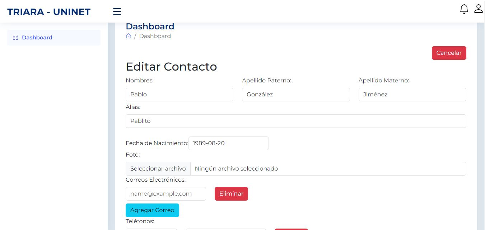
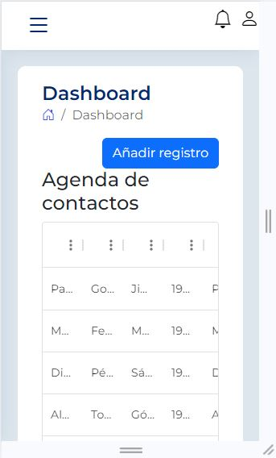

### README.md

---

## Catálogo Simple de Contactos

Este proyecto implementa un catálogo simple de contactos, permitiendo la gestión de información básica de contactos como nombres, correos electrónicos, teléfonos, direcciones y fotografía.

### Aspectos a Evaluar

1. **Lenguaje de Programación Back-end**
   - El proyecto está desarrollado en Python utilizando el framework Django.

2. **Código**
   - Se enfatiza en la calidad, legibilidad y documentación del código.

3. **Base de Datos**
   - Se utiliza PostgreSQL como base de datos relacional.
   - Se recomienda el uso de transacciones y/o procedimientos almacenados.
   - Incluye un diagrama Entidad-Relación y un diccionario de datos.

4. **Arquitectura**
   - Existe una separación mínima entre capas de lógica y presentación en el código fuente.

5. **Interfaz de Usuario**
   - HTML bien formado, CSS y operaciones programadas en JavaScript (validaciones del lado del cliente).

### Definición del Problema

El objetivo es desarrollar un sistema que permita manejar la información detallada de contactos, incluyendo:

- Nombres
- Apellido paterno
- Apellido materno
- Fecha de nacimiento
- Alias
- Correos electrónicos
- Teléfonos etiquetados por el usuario
- Direcciones
- Fotografía (subir archivo .png)

El sistema debe proporcionar al menos:

- Formulario para dar de alta un nuevo contacto.
- Modo (listado, búsqueda, etc.) para editar datos de un contacto existente.
- Funcionalidad para dar de baja un contacto.

### Modelo Entidad-Relación y Diccionario de Datos

#### Modelo Entidad-Relación (MER)


- **Tabla `Usuario`:**
  - `id` (PK)
  - `nombres`
  - `apellido_paterno`
  - `apellido_materno`
  - `fecha_nacimiento`
  - `alias`
  - `foto` (archivo .png)

- **Tabla `CorreoElectronico`:**
  - `id` (PK)
  - `usuario_id` (FK a `Usuario`)
  - `correo`

- **Tabla `Telefono`:**
  - `id` (PK)
  - `usuario_id` (FK a `Usuario`)
  - `tipo`
  - `numero`

- **Tabla `Direccion`:**
  - `id` (PK)
  - `usuario_id` (FK a `Usuario`)
  - `calle`
  - `numero_exterior`
  - `colonia`
  - `ciudad`
  - `estado`
  - `pais`
  - `codigo_postal`

#### Diccionario de Datos

- **Tabla `Usuario`:**
  - `id`: INT (PK)
  - `nombres`: VARCHAR
  - `apellido_paterno`: VARCHAR
  - `apellido_materno`: VARCHAR
  - `fecha_nacimiento`: DATE
  - `alias`: VARCHAR
  - `foto`: VARCHAR (ruta o nombre del archivo .png)

- **Tabla `CorreoElectronico`:**
  - `id`: INT (PK)
  - `usuario_id`: INT (FK a `Usuario`)
  - `correo`: VARCHAR

- **Tabla `Telefono`:**
  - `id`: INT (PK)
  - `usuario_id`: INT (FK a `Usuario`)
  - `tipo`: VARCHAR
  - `numero`: VARCHAR

- **Tabla `Direccion`:**
  - `id`: INT (PK)
  - `usuario_id`: INT (FK a `Usuario`)
  - `calle`: VARCHAR
  - `numero_exterior`: VARCHAR
  - `colonia`: VARCHAR
  - `ciudad`: VARCHAR
  - `estado`: VARCHAR
  - `pais`: VARCHAR
  - `codigo_postal`: VARCHAR

### Configuración del Entorno

#### Configuración del Entorno Virtual de Python

1. **Instalación de Virtualenv**

   ```bash
   pip install virtualenv
   ```

2. **Creación y Activación del Entorno Virtual**

   ```bash
   virtualenv env
   source env/bin/activate  # En Windows: env\Scripts\activate
   ```

#### Instalación de Django y Dependencias

1. **Instalación de Django**

   ```bash
   pip install django
   ```

2. **Instalación de Dependencias Adicionales**

   ```bash
   pip install pillow  # Para trabajar con imágenes (p.ej. foto de perfil)
   ```

#### Configuración de la Base de Datos en PostgreSQL

1. **Instalación de PostgreSQL**

   - Descarga e instalación desde [PostgreSQL Downloads](https://www.postgresql.org/download/).

2. **Configuración en Django**

   - En `settings.py`:

     ```python
     DATABASES = {
         'default': {
             'ENGINE': 'django.db.backends.postgresql',
             'NAME': 'nombre_basededatos',
             'USER': 'usuario_postgresql',
             'PASSWORD': 'contraseña_postgresql',
             'HOST': 'localhost',
             'PORT': '5432',
         }
     }
     ```

3. **Creación de la Base de Datos y Migraciones Iniciales**

   - Creación de la base de datos:

     ```bash
     createdb -U usuario_postgresql nombre_basededatos
     ```

   - Generación de migraciones iniciales y aplicación a la base de datos:

     ```bash
     python manage.py makemigrations
     python manage.py migrate
     ```

### Modelos en Django para Creación de Tablas

#### Ejemplo de Modelos (models.py)

```python
from django.db import models

class Usuario(models.Model):
    nombres = models.CharField(max_length=100)
    apellido_paterno = models.CharField(max_length=100)
    apellido_materno = models.CharField(max_length=100)
    fecha_nacimiento = models.DateField()
    alias = models.CharField(max_length=50)
    foto = models.ImageField(upload_to='fotos/', null=True, blank=True)

class CorreoElectronico(models.Model):
    usuario = models.ForeignKey(Usuario, related_name='correos', on_delete=models.CASCADE)
    correo = models.EmailField()

class Telefono(models.Model):
    usuario = models.ForeignKey(Usuario, related_name='telefonos', on_delete=models.CASCADE)
    tipo = models.CharField(max_length=50)
    numero = models.CharField(max_length=20)

class Direccion(models.Model):
    usuario = models.ForeignKey(Usuario, related_name='direcciones', on_delete=models.CASCADE)
    calle = models.CharField(max_length=100)
    numero_exterior = models.CharField(max_length=10)
    colonia = models.CharField(max_length=100)
    ciudad = models.CharField(max_length=100)
    estado = models.CharField(max_length=100)
    pais = models.CharField(max_length=100)
    codigo_postal = models.CharField(max_length=10)
```

### Visualización Final

1. **Inicio del Servidor de Desarrollo de Django**

   ```bash
   python manage.py runserver
   ```

2. **Acceso al Proyecto en el Navegador**

   Abre [http://localhost:8000](http://localhost:8000) para ver la aplicación.

---

Para copiar y configurar el repositorio de tu proyecto de catálogo de contactos, siguiendo los pasos para instalar y ejecutar tanto el backend de Django como el frontend en React, aquí tienes los pasos detallados:

### Clonar y Configurar el Repositorio

1. **Clonar el Repositorio:**

   Abre tu terminal y ejecuta el siguiente comando para clonar el repositorio desde GitHub (o tu repositorio remoto):

   ```bash
   git clone <url_del_repositorio>
   ```

   Sustituye `<url_del_repositorio>` con la URL de tu repositorio de GitHub.

2. **Configurar el Backend Django:**

   Asegúrate de tener Python y Django instalados en tu sistema. Luego, configura el entorno virtual y las dependencias del proyecto:

   ```bash
   cd backend
   python -m venv venv
   source venv/bin/activate  # Para macOS/Linux
   # venv\Scripts\activate    # Para Windows
   pip install -r requirements.txt
   ```

   Esto creará un entorno virtual y luego instalará todas las dependencias especificadas en `requirements.txt`.

3. **Configurar la Base de Datos:**

   Asegúrate de tener PostgreSQL instalado y configurado. Puedes modificar la configuración de la base de datos en `backend/settings.py` según sea necesario.

   Luego, realiza las migraciones para configurar la base de datos:

   ```bash
   python manage.py makemigrations
   python manage.py migrate
   ```

4. **Iniciar el Backend Django:**

   Una vez configurada la base de datos, inicia el servidor de desarrollo de Django:

   ```bash
   python manage.py runserver
   ```

   El servidor se iniciará en `http://localhost:8000`.

5. **Configurar el Frontend React:**

   Ahora, dirígete al directorio del frontend y configura las dependencias de React:

   ```bash
   cd frontend
   npm install
   ```

6. **Iniciar el Frontend React:**

   Una vez que se hayan instalado todas las dependencias de React, puedes iniciar el servidor de desarrollo:

   ```bash
   npm start
   ```

   El servidor de desarrollo de React se iniciará en `http://localhost:3000`.

### Acceder a la Aplicación

Ahora que ambos servidores (Django backend y React frontend) están en funcionamiento, puedes acceder a la aplicación desde tu navegador:

- **Backend Django:** Accede a `http://localhost:8000` para verificar que el backend esté funcionando correctamente y para interactuar con la API de contactos.

- **Frontend React:** Accede a `http://localhost:3000` para ver la interfaz de usuario del catálogo de contactos. Aquí podrás crear, editar y eliminar contactos, además de gestionar correos electrónicos, teléfonos y direcciones asociadas.

Con estos pasos, deberías poder clonar el repositorio de tu proyecto, configurar tanto el backend de Django como el frontend en React, e iniciar ambos servidores para ejecutar la aplicación de catálogo de contactos en tu entorno local.


##Visualización Final
Para visualizar la aplicación final, asegúrate de tener tanto el servidor de desarrollo de React como el servidor de Django ejecutándose simultáneamente. Utiliza las rutas y los componentes adecuados para interactuar con el backend y mostrar los datos de contactos de manera efectiva en tu interfaz de usuario.

Con estos pasos detallados, deberías tener una configuración básica y funcional del frontend en React integrado con tu backend Django para el catálogo de contactos.

Inicio de la aplicación

Generar nuevo registro
 
Visualización de detalles

Edición

Diseño responsive
 
